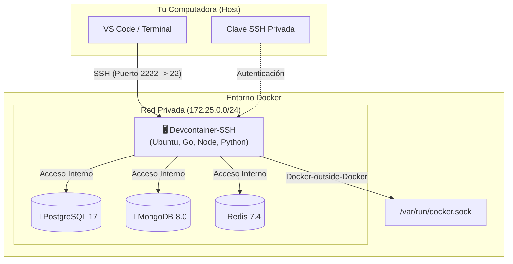
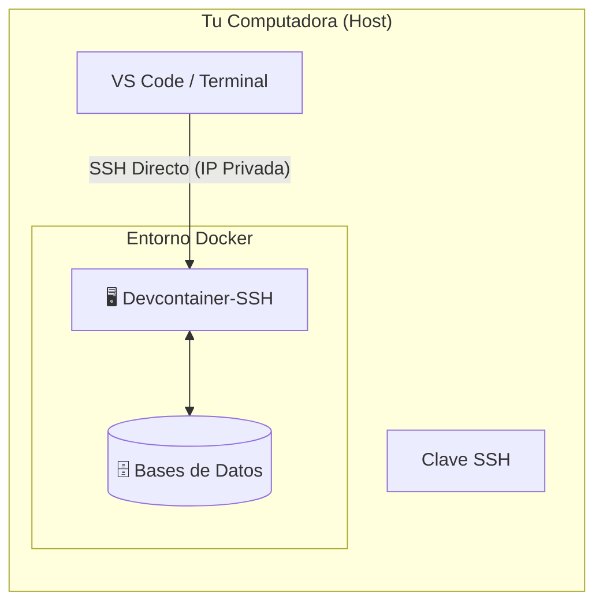
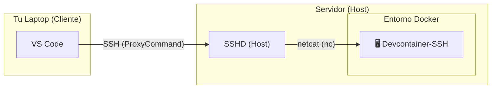
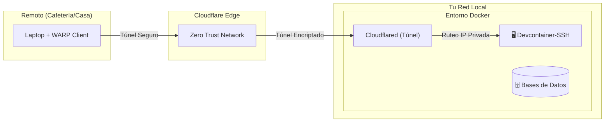

# my-devcontainer-installer

Este repositorio proporciona un entorno de desarrollo completo y remoto basado en Docker. Está diseñado para simplificar la configuración de proyectos que requieren múltiples tecnologías (bases de datos, lenguajes, herramientas) y una conectividad de red avanzada.

El entorno ofrece un contenedor principal (`devcontainer-ssh`) accesible vía SSH, con acceso directo a bases de datos y herramientas de desarrollo preinstaladas, simulando una máquina virtual ligera pero con la flexibilidad de Docker.

## Arquitectura

El siguiente diagrama ilustra cómo interactúan los componentes del entorno:



### 1. Acceso Local (Tu PC es el Host)

Ideal cuando trabajas directamente en la máquina que ejecuta Docker.



### 2. Acceso Remoto LAN (Laptop -> Servidor)

Conéctate desde tu laptop a un servidor (ej. Raspberry Pi, Mini PC) en tu misma red.



### 3. Acceso Remoto Seguro (Cloudflare Tunnel)

Accede desde cualquier lugar del mundo sin abrir puertos, usando Cloudflare Zero Trust.



## Características Principales

* **Sistema Base:** Ubuntu 22.04 LTS.
* **Conexión SSH:** Acceso seguro mediante OpenSSH Server. Ideal para usar con VS Code Remote - SSH o tu terminal favorita.
* **Persistencia y Sincronización:**
  * El directorio del repositorio se monta en `/workspace` dentro del contenedor.
  * Los archivos de configuración y datos de usuario (`/home`, `/root`, `/etc`) se persisten en volúmenes Docker.
* **Bases de Datos (Dockerizadas):**
  * MongoDB 8.0
  * Redis 7.4 (Alpine)
  * PostgreSQL 17 (Alpine)
* **Lenguajes y Herramientas Preinstalados:**
  * **Java:** JDK Temurin 11 y 17 + Maven.
  * **Python:** Python 3 + pip.
  * **Node.js:** NVM (Node Version Manager) preinstalado para gestionar versiones.
  * **Go:** Última versión (instalada vía script utilitario).
  * **SQLite:** sqlite3.
  * **Herramientas CLI:** `git`, `gh` (GitHub CLI), `docker-ce-cli` (Docker outside Docker), `nano`, `wget`, `jq`.
* **Terminal Mejorada:** ZSH preconfigurado con frameworks y plugins útiles.

## Requisitos Previos

* Docker y Docker Compose.
* Cliente SSH (OpenSSH) instalado en tu máquina local.
* Conocimiento básico de terminal.

## Instalación y Configuración

1. **Clonar el repositorio:**

    ```bash
    git clone https://github.com/Joacohbc/my-devcontainer-installer.git .dev-env && cd .dev-env
    ```

2. **Iniciar el entorno:**

    Si deseas personalizar la configuración de red (opcional), crea un archivo `.env` antes de iniciar (ver [CLOUDFLARE_TUNNEL.md](CLOUDFLARE_TUNNEL.md)). De lo contrario, simplemente ejecuta:

    ```bash
    docker compose up -d --build
    ```

## Acceso y Uso

La forma recomendada y más segura de acceder es mediante **Claves SSH**. El uso de contraseñas debería limitarse únicamente a la configuración inicial.

### 1. Preparación (Host)

Primero, obtén la contraseña temporal generada durante la instalación. La necesitarás **solo una vez** para instalar tu clave SSH.

```bash
docker compose logs devcontainer-ssh | grep "devuser password" | tail -n 1
```

### 2. Configurar Acceso SSH (Recomendado)

Sigue estos pasos desde tu máquina local (tu PC o Laptop) para autorizar tu acceso sin contraseña.

#### A. Generar par de claves (Si no tienes una)

Se recomienda usar una clave específica para este entorno:

```bash
ssh-keygen -t ed25519 -f ~/.ssh/id_devcontainer -N "" -q
```

#### B. Instalar la clave en el contenedor

**Opción 1: Entorno Local**
(Si Docker corre en la misma máquina que estás usando)

```bash
# 1. Obtener IP del contenedor
IP_SSH=$(docker inspect -f '{{range .NetworkSettings.Networks}}{{.IPAddress}}{{end}}' devcontainer-ssh)

# 2. Copiar clave (te pedirá la contraseña obtenida en el paso 1)
ssh-copy-id -i ~/.ssh/id_devcontainer.pub devuser@$IP_SSH

# 3. Guardar configuración en tu SSH config
cat <<EOF >> ~/.ssh/config
Host devcontainer
    HostName $IP_SSH
    IdentityFile ~/.ssh/id_devcontainer
    User devuser
EOF
```

**Opción 2: Entorno Remoto**
(Si Docker corre en un servidor y tú estás en tu laptop)

Sustituye `usuario@servidor` por los datos de conexión a tu servidor físico.

```bash
cat ~/.ssh/id_devcontainer.pub | ssh usuario@servidor "docker exec -i -u devuser devcontainer-ssh sh -c 'mkdir -p ~/.ssh && cat >> ~/.ssh/authorized_keys && chmod 700 ~/.ssh && chmod 600 ~/.ssh/authorized_keys'"
```

Para conectar fácilmente, añade esto a tu `~/.ssh/config`:

```ssh
Host devcontainer-remote
    User devuser
    IdentityFile ~/.ssh/id_devcontainer
    ProxyCommand ssh usuario@servidor "nc -q0 \$(docker inspect -f '{{range .NetworkSettings.Networks}}{{.IPAddress}}{{end}}' devcontainer-ssh) 22"
```

### 3. Conectarse

Ahora puedes conectar simplemente con el alias que hayas configurado:

```bash
ssh devcontainer
# O
ssh devcontainer-remote
```

## Pasos Post-Instalación

Una vez dentro, puedes ejecutar los scripts de configuración incluidos para terminar de preparar tu entorno:

*   **GitHub CLI:** `/workspace/login-github-cli.sh`
*   **Actualizar Go:** `/workspace/update_golang.sh`

Consulta [POST_INSTALL_STEPS.md](POST_INSTALL_STEPS.md) para más detalles sobre backups y herramientas adicionales.

## Solución de Problemas (Troubleshooting)

### Error: "Permission denied (publickey)"
*   Asegúrate de haber copiado tu clave pública (`.pub`) al contenedor correctamente.
*   Verifica los permisos en el contenedor: la carpeta `~/.ssh` debe tener `700` y `authorized_keys` debe tener `600`.

### Error: "Connection refused"
*   Verifica que el contenedor esté corriendo: `docker compose ps`.
*   Si usas IP dinámica (Local), asegúrate de que la IP no haya cambiado. Si reiniciaste el contenedor, es posible que necesites actualizar la IP en tu `~/.ssh/config`.

### Problemas con Docker dentro del contenedor
*   Si comandos como `docker ps` fallan dentro del contenedor, verifica que el socket esté montado correctamente en `docker-compose.yml`:
    `- /var/run/docker.sock:/var/run/docker.sock`
*   Asegúrate de que el usuario `devuser` pertenezca al grupo `docker` (esto se hace automáticamente en el Dockerfile).

### Conflicto de Puertos
*   Si Docker falla al iniciar porque un puerto (ej. 27017, 5432) ya está en uso, detén el servicio local que lo ocupa en tu máquina host o modifica el mapeo de puertos en `docker-compose.yml`.

## Estructura del Proyecto

*   `Dockerfile`: Configuración de la imagen base.
*   `docker-compose.yml`: Orquestación de servicios.
*   `zsh-installer.sh`, `golang_utils.sh`, `login-github-cli.sh`: Scripts de utilidad.

## Bases de Datos

Credenciales por defecto: **Usuario:** `devuser` / **Password:** `devpass`.

*   **PostgreSQL:** `psql -h postgres -U devuser -d devdb`
*   **MongoDB:** `mongosh --host mongo -u devuser -p devpass --authenticationDatabase admin`
*   **Redis:** `redis-cli -h redis`
