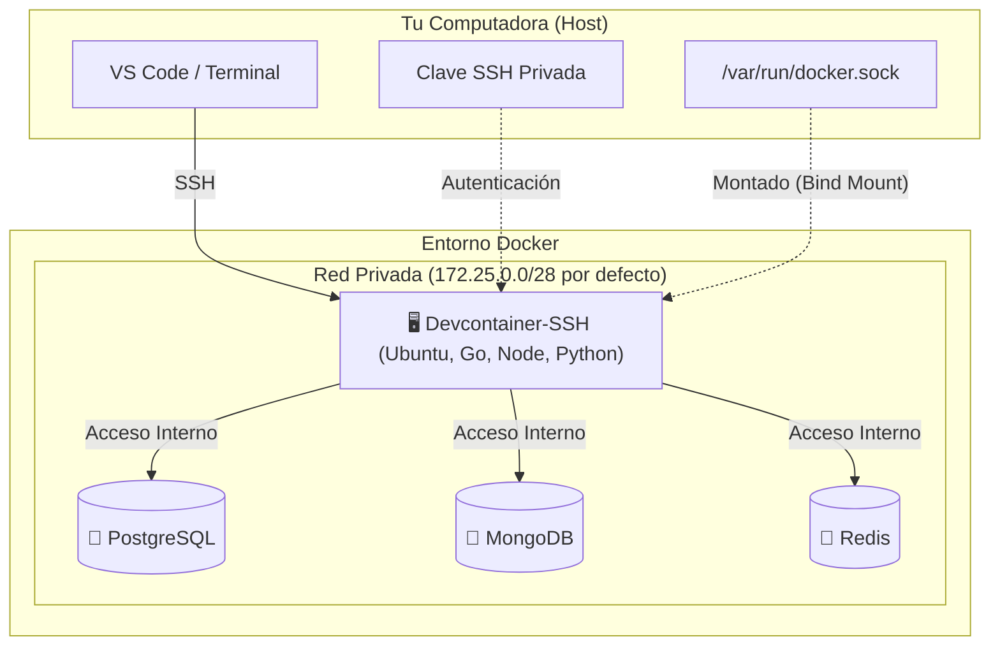
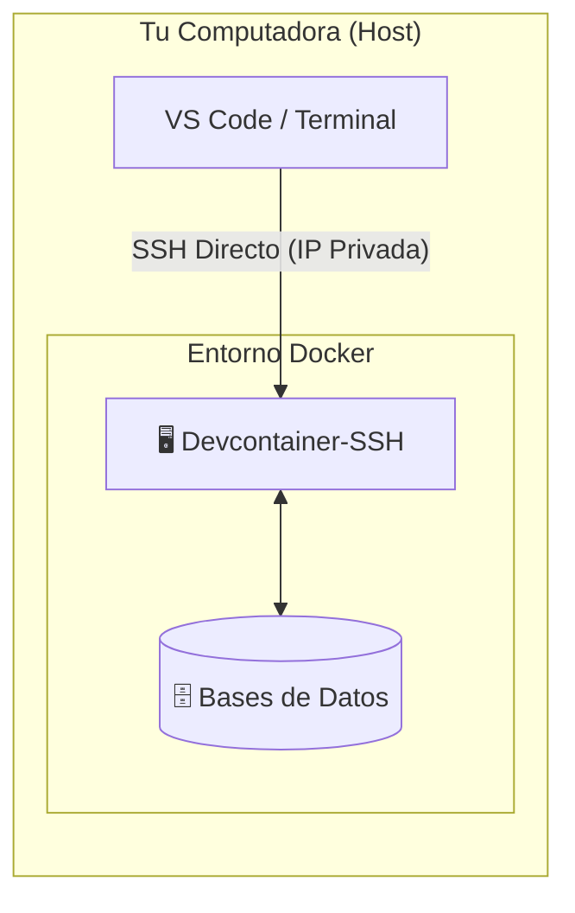
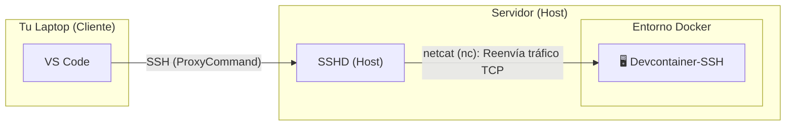
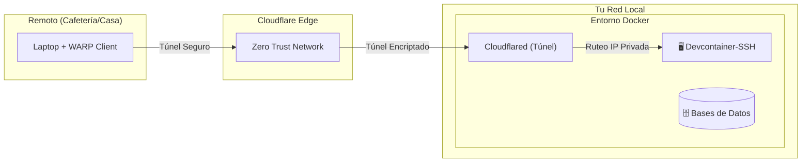

# my-devcontainer-installer

Este repositorio proporciona un entorno de desarrollo completo y remoto basado en Docker. Está diseñado para simplificar la configuración de proyectos que requieren múltiples tecnologías (bases de datos, lenguajes, herramientas) y una conectividad de red avanzada.

El entorno ofrece un contenedor principal (`devcontainer-ssh`) accesible vía SSH, con acceso directo a bases de datos y herramientas de desarrollo preinstaladas, simulando una máquina virtual ligera pero con la flexibilidad de Docker.

Todo se genera y administra con la CLI `devcontainer-cli`.

> 📖 **Referencia completa de la CLI** (todos los subcomandos, flags y modos de build): [DOC_CLI.md](DOC_CLI.md).

## Arquitectura

El siguiente diagrama ilustra cómo interactúan los componentes del entorno:



### 1. Acceso Local (Tu PC es el Host)

**Recomendado para**: Trabajar directamente en la máquina donde corre Docker.

Se establece una conexión SSH directa desde tu terminal o VS Code hacia la IP privada del contenedor, aprovechando que ambos están en el mismo equipo. Sin exponer puertos.



### 2. Acceso Remoto LAN (Laptop -> Servidor)

**Recomendado para**: Conectar tu laptop a un servidor doméstico (ej. Raspberry Pi, Mini PC) dentro de tu red.

Utiliza el servicio SSH del servidor anfitrión como puente seguro. El tráfico se redirige internamente hacia el contenedor (usando netcat), lo que evita tener que exponer puertos del contenedor a toda la red local.



### 3. Acceso Remoto Seguro (Cloudflare Tunnel)

**Recomendado para**: Acceder desde cualquier lugar (cafeterías, viajes) sin abrir puertos en el router.

Mediante Cloudflare Zero Trust, se crea un túnel cifrado de salida. Esto permite que tu dispositivo remoto (autenticado con WARP) acceda a la red privada del contenedor de forma segura, como si estuvieras conectado localmente.



Detalles de la configuración del túnel en [CLOUDFLARE_TUNNEL.md](CLOUDFLARE_TUNNEL.md).

## Características Principales

* **Sistema Base:** Ubuntu 24.04 LTS (Noble) por defecto. 22.04 (Jammy) seleccionable.
* **Conexión SSH:** Acceso seguro mediante OpenSSH Server. Ideal para usar con VS Code Remote - SSH o tu terminal favorita.
* **Persistencia y Sincronización:**
  * El directorio del repositorio se monta en `/workspace` dentro del contenedor.
  * Los archivos de configuración y datos de usuario (`/home`, `/root`, `/etc`) se persisten en volúmenes Docker.
* **Bases de Datos (Dockerizadas, versión configurable por la CLI):**
  * MongoDB — default `8.0` (opciones: `7.0`, `8.0`, `8.3`).
  * Redis — default `7.4-alpine` (opciones: `7.4-alpine`, `8.0-alpine`, `8.6-alpine`).
  * PostgreSQL — default `17-alpine` (opciones: `16-alpine`, `17-alpine`, `18-alpine`).
* **Lenguajes y Herramientas Preinstalados (módulos opcionales):**
  * **Java:** Temurin (default 17+21) u OpenJDK (default 17), Maven opcional. Versiones 11/17/21 disponibles.
  * **Python:** Python 3 + pip, con `uv` (Astral) opcional.
  * **Node.js:** `nvm` (default) o `fnm`. Versión: LTS, 22 o 24.
  * **pnpm / Bun:** instaladores oficiales como módulos opcionales.
  * **Go:** Última versión (instalada vía script utilitario, módulo `go`).
  * **SQLite:** sqlite3 (módulo `sqlite`).
  * **Tmux:** tmux (módulo `tmux`).
  * **Clientes de DB en el devcontainer:** `psql`, `redis-tools`, `mongosh` (módulo `dbclients`, seleccionables individualmente).
  * **GitHub CLI:** `gh` + `jq` (módulo `github-cli`, incluido por defecto).
  * **Docker (acceso al daemon):** el módulo `dod` instala `docker-ce-cli` en la imagen. El motor lo provee el servicio `docker-dind` (`docker:28-dind-rootless`), que expone el daemon vía `DOCKER_HOST=tcp://docker-dind:2375` en una red aislada. Ambos deben activarse juntos — sin el servicio `docker-dind` no hay engine al que conectarse.
  * **AI CLIs (opcional, módulo `ai-clis`):** scripts de instalación embebidos para Claude Code, OpenCode, Codex CLI, Antigravity CLI y GitHub Copilot CLI.
* **Herramientas base:** `git`, `nano`, `wget`, `curl`, `unzip`, `ca-certificates` — siempre presentes.
* **Terminal Mejorada:** ZSH preconfigurado con frameworks y plugins útiles.

## Requisitos Previos

* Docker y Docker Compose.
* Cliente SSH (OpenSSH) instalado en tu máquina local.
* Conocimiento básico de terminal.

### Nota Importante para Windows

Si estás utilizando **Windows**, se recomienda encarecidamente usar **Git Bash** como terminal. Esto garantiza la compatibilidad con los comandos de Linux (`grep`, `tail`, `ssh-copy-id`, etc.) y facilita la configuración.

1.  **Formato de Archivos (LF vs CRLF):** Los scripts y archivos de configuración deben tener terminaciones de línea estilo UNIX (`LF`). Se ha incluido un archivo `.gitattributes` para manejar esto automáticamente.
2.  **Firewall:** Para conectarte al contenedor, es necesario que el firewall de Windows permita las conexiones al puerto expuesto (por defecto `2222`).

## Instalación de la CLI

**Linux / macOS:**

```bash
curl -fsSL https://raw.githubusercontent.com/Joacohbc/my-devcontainer-installer/main/cli/install.sh | sh
```

Detecta OS/arch automáticamente. Descarga el binario (single executable con assets embebidos) en `~/.local/share/devcontainer-cli/` y lo enlaza en `~/.local/bin/devcontainer-cli`.

**Windows (PowerShell):**

```powershell
irm https://raw.githubusercontent.com/Joacohbc/my-devcontainer-installer/main/cli/install.ps1 | iex
```

Instala en `%LOCALAPPDATA%\devcontainer-cli` y agrega al PATH del usuario.

**Variables opcionales:**

| Var          | Default                                  | Descripción                       |
|--------------|------------------------------------------|-----------------------------------|
| `VERSION`    | `latest`                                 | Tag específico (ej. `v1.0.0`)     |
| `INSTALL_DIR`| `~/.local/share/devcontainer-cli` (unix) | Carpeta del binario               |
| `BIN_DIR`    | `~/.local/bin` (unix)                    | Symlink al binario                |

Ejemplo versión fija:

```bash
curl -fsSL https://raw.githubusercontent.com/Joacohbc/my-devcontainer-installer/main/cli/install.sh | VERSION=v1.0.0 sh
```

**Descarga manual** (alternativa): https://github.com/Joacohbc/my-devcontainer-installer/releases/latest — binarios disponibles: `devcontainer-cli-linux-x64`, `-linux-arm64`, `-darwin-x64` y `-windows-x64.exe`. Son ejecutables únicos (assets embebidos via Node.js SEA); descargás, `chmod +x` y listo.

### Desinstalación

Si deseas eliminar la CLI y sus configuraciones:

**Linux / macOS:**

```bash
curl -fsSL https://raw.githubusercontent.com/Joacohbc/my-devcontainer-installer/main/cli/uninstall.sh | sh
```

**Windows (PowerShell):**

```powershell
irm https://raw.githubusercontent.com/Joacohbc/my-devcontainer-installer/main/cli/uninstall.ps1 | iex
```

### Autocompletado

El instalador configura el autocompletado automáticamente en `.zshrc` y `.bashrc`/`.bash_profile`. Si por algún motivo falla, podés habilitarlo a mano:

```bash
# Zsh
devcontainer-cli completion zsh > ~/.local/share/devcontainer-cli/completions/_devcontainer-cli
# Agregar a ~/.zshrc:
#   fpath=(~/.local/share/devcontainer-cli/completions $fpath)
#   autoload -U compinit && compinit

# Bash
devcontainer-cli completion bash > ~/.local/share/devcontainer-cli/completions/devcontainer-cli.bash
# Agregar a ~/.bashrc:
#   source ~/.local/share/devcontainer-cli/completions/devcontainer-cli.bash
```

> Para deshabilitar la configuración automática al instalar: `SETUP_COMPLETION=0 sh install.sh`

## Uso rápido

Una vez instalada la CLI, generá el entorno dentro de la carpeta de tu proyecto y levantalo:

```bash
mkdir mi-proyecto && cd mi-proyecto
devcontainer-cli                       # flujo interactivo: elegís módulos y servicios
docker compose -f .dc_mi-proyecto/build/docker-compose.yml up -d
```

Eso genera el `Dockerfile`, `docker-compose.yml`, `.env` y scripts auxiliares dentro de `.dc_<workspace>/`.

> 📖 Para el flujo no-interactivo, todos los subcomandos (`run`, `port-forward`, `update`, `down`, `prune`, `config`…), los modos de build y la estructura generada, ver **[DOC_CLI.md](DOC_CLI.md)**.

## Acceso y Uso

La forma recomendada y más segura de acceder es mediante **Claves SSH**. El uso de contraseñas debería limitarse únicamente a la configuración inicial.

### 1. Obtener la contraseña temporal (Host)

Primero, obtén la contraseña generada durante la instalación. La necesitarás **solo una vez** para instalar tu clave SSH.

```bash
docker compose logs devcontainer-ssh | grep "devuser password" | tail -n 1
```

### 2. Configurar el acceso SSH

#### Opción A: Modo automático (recomendado)

La CLI genera la clave, la copia al contenedor y deja listo el bloque `~/.ssh/config` por ti:

```bash
devcontainer-cli setup-ssh
```

Detecta el `container_name` y el modo (`local`, `windows`, `remote`) automáticamente. Detalles y flags en **[DOC_CLI.md → Configurar acceso SSH](DOC_CLI.md#configurar-acceso-ssh-setup-ssh)**.

#### Opción B: Manual

Sigue estos pasos desde tu máquina local (tu PC o Laptop) para autorizar tu acceso sin contraseña.

##### A. Generar par de claves (si no tienes una)

```bash
ssh-keygen -t ed25519 -f ~/.ssh/id_devcontainer -N "" -q
```

##### B. Instalar la clave en el contenedor

**Opción 1: Entorno Local (Linux/Mac)**
(Si Docker corre en la misma máquina que estás usando)

> El `container_name` real se prefija con el `workspace` configurado (ej: `mi-proyecto-devcontainer-ssh`). Reemplaza `<workspace>` por el nombre que elegiste en la CLI (o consulta `docker ps`).

```bash
# 1. Obtener IP del contenedor
# Nota: si el contenedor está en varias redes Docker, inspect devuelve una IP
# por línea; `head -n1` se queda con la primera.
IP_SSH=$(docker inspect -f '{{range .NetworkSettings.Networks}}{{.IPAddress}}{{"\n"}}{{end}}' <workspace>-devcontainer-ssh | head -n1)

# 2. Copiar clave (te pedirá la contraseña obtenida en el paso 1)
ssh-copy-id -i ~/.ssh/id_devcontainer.pub devuser@$IP_SSH

# 3. Guardar configuración en tu SSH config
cat <<EOF >> ~/.ssh/config
Host devcontainer
    HostName $IP_SSH
    IdentityFile ~/.ssh/id_devcontainer
    User devuser
EOF
```

**Opción 2: Entorno Local (Windows con Git Bash)**
(Usando el puerto expuesto 2222)

```bash
# 1. Copiar clave pública al contenedor (te pedirá la contraseña)
# Nota: Git Bash suele incluir ssh-copy-id, si no, usa el comando manual:
ssh-copy-id -p 2222 -i ~/.ssh/id_devcontainer.pub devuser@localhost

# Alternativa manual si ssh-copy-id no está disponible:
# cat ~/.ssh/id_devcontainer.pub | ssh -p 2222 devuser@localhost "mkdir -p ~/.ssh && cat >> ~/.ssh/authorized_keys && chmod 700 ~/.ssh && chmod 600 ~/.ssh/authorized_keys"

# 2. Añadir a config (Ejecuta esto en Git Bash)
cat <<EOF >> ~/.ssh/config
Host devcontainer
    HostName localhost
    Port 2222
    User devuser
    IdentityFile ~/.ssh/id_devcontainer
EOF
```

**Opción 3: Entorno Remoto**
(Si Docker corre en un servidor y tú estás en tu laptop)

Sustituye `usuario@servidor` por los datos de conexión a tu servidor físico.

```bash
cat ~/.ssh/id_devcontainer.pub | ssh usuario@servidor "docker exec -i -u devuser <workspace>-devcontainer-ssh sh -c 'mkdir -p ~/.ssh && cat >> ~/.ssh/authorized_keys && chmod 700 ~/.ssh && chmod 600 ~/.ssh/authorized_keys'"
```

Para conectar fácilmente, añade esto a tu `~/.ssh/config`:

```ssh
Host devcontainer-remote
    User devuser
    IdentityFile ~/.ssh/id_devcontainer
    ProxyCommand ssh usuario@servidor "nc -q0 \$(docker inspect -f '{{range .NetworkSettings.Networks}}{{.IPAddress}}{{\"\n\"}}{{end}}' <workspace>-devcontainer-ssh | head -n1) 22"
```

### 3. Conectarse

Ahora puedes conectar simplemente con el alias que hayas configurado:

```bash
ssh devcontainer
# O
ssh devcontainer-remote
```

## Pasos Post-Instalación

Una vez dentro del contenedor puedes terminar de preparar tu entorno: login de GitHub CLI, actualizar Go, instalar CLIs de IA, backups de base de datos, etc. Los scripts viven horneados en `~/post-script/`.

Consulta **[POST_INSTALL_STEPS.md](POST_INSTALL_STEPS.md)** para el detalle.

## Agregar Servicios Extra (Docker Run)

Para levantar un contenedor nuevo (por ejemplo, una base de datos extra o un servicio temporal) asegurando que el DevContainer pueda verlo y conectarse a él, es necesario que ambos compartan la misma red Docker.

La red Docker generada se llama `<workspace>-network` (donde `<workspace>` es el nombre que configuraste en la CLI). Puedes usar el siguiente comando, que detecta automáticamente el nombre de la red del proyecto y conecta el nuevo servicio:

```bash
docker run -d \
  --name <nombre-del-servicio> \
  --network $(docker network ls -q -f name=<workspace>-network) \
  <imagen>
```

**Explicación de las banderas:**

*   `--network $(...)`: Busca dinámicamente el ID de la red `<workspace>-network` del proyecto.
*   `--name`: Asigna el hostname. Esto permite que, desde dentro del DevContainer, puedas hacer ping o conectarte usando este nombre (ej: `ping <nombre-del-servicio>`).

## Solución de Problemas (Troubleshooting)

### Error: "Permission denied (publickey)"

* Asegúrate de haber copiado tu clave pública (`.pub`) al contenedor correctamente.
* Verifica los permisos en el contenedor: la carpeta `~/.ssh` debe tener `700` y `authorized_keys` debe tener `600`.

### Error: "Connection refused"

* Verifica que el contenedor esté corriendo: `docker compose ps`.
* Si usas IP dinámica (Local), asegúrate de que la IP no haya cambiado. Si reiniciaste el contenedor, es posible que necesites actualizar la IP en tu `~/.ssh/config`.
* **Windows:** Verifica que el Firewall de Windows permita conexiones entrantes al puerto 2222.

### Problemas con Docker dentro del contenedor

* Si comandos como `docker ps` fallan dentro del contenedor, verifica que el socket esté montado correctamente en `docker-compose.yml`:
    `- /var/run/docker.sock:/var/run/docker.sock`
* Asegúrate de que el usuario `devuser` pertenezca al grupo `docker` (esto se hace automáticamente en el Dockerfile).

### Conflicto de Puertos

* Si Docker falla al iniciar porque un puerto (ej. 27017, 5432, 2222) ya está en uso, detén el servicio local que lo ocupa en tu máquina host o modifica el mapeo de puertos en `.dc_<workspace>/build/docker-compose.yml`.

## Bases de Datos

Credenciales por defecto: **Usuario:** `devuser` / **Password:** `devpass`.

Desde dentro del devcontainer (los hostnames son los nombres de servicio en `docker-compose.yml`, sin el prefijo del workspace):

* **PostgreSQL:** `psql -h postgres -U devuser -d devdb`
* **MongoDB:** `mongosh --host mongo -u devuser -p devpass --authenticationDatabase admin`
* **Redis:** `redis-cli -h redis`

> Los clientes (`psql`, `mongosh`, `redis-cli`) solo están preinstalados si seleccionaste el módulo `dbclients` al generar el entorno.
