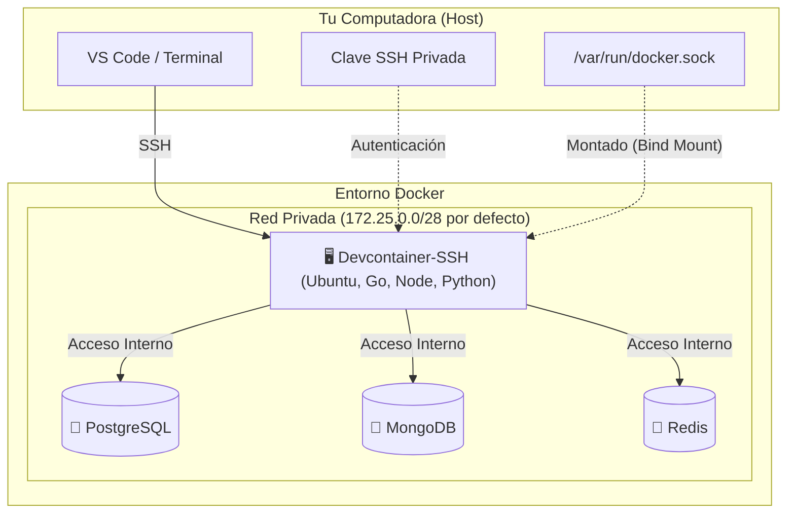
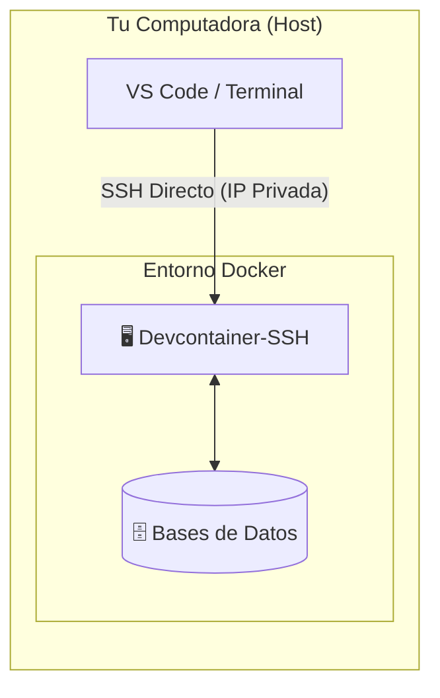
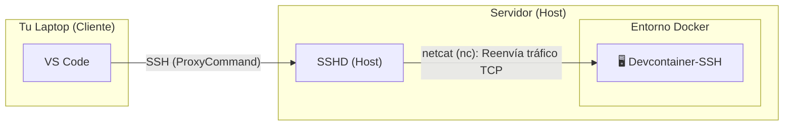
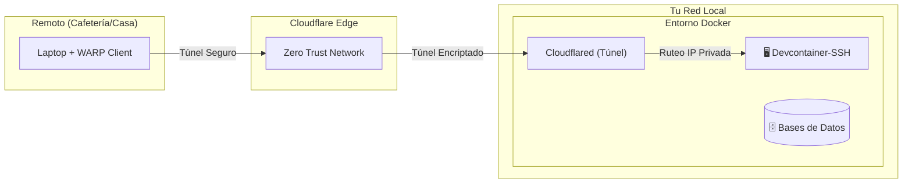

# my-devcontainer-installer

Este repositorio proporciona un entorno de desarrollo completo y remoto basado en Docker. Está diseñado para simplificar la configuración de proyectos que requieren múltiples tecnologías (bases de datos, lenguajes, herramientas) y una conectividad de red avanzada.

El entorno ofrece un contenedor principal (`devcontainer-ssh`) accesible vía SSH, con acceso directo a bases de datos y herramientas de desarrollo preinstaladas, simulando una máquina virtual ligera pero con la flexibilidad de Docker.

Todo se genera y administra con la CLI `devcontainer-cli`.

## Arquitectura

El siguiente diagrama ilustra cómo interactúan los componentes del entorno:



### 1. Acceso Local (Tu PC es el Host)

**Recomendado para**: Trabajar directamente en la máquina donde corre Docker.

Se establece una conexión SSH directa desde tu terminal o VS Code hacia la IP privada del contenedor, aprovechando que ambos están en el mismo equipo. Sin exponer puertos.



### 2. Acceso Remoto LAN (Laptop -> Servidor)

**Recomendado para**: Conectar tu laptop a un servidor doméstico (ej. Raspberry Pi, Mini PC) dentro de tu red.

Utiliza el servicio SSH del servidor anfitrión como puente seguro. El tráfico se redirige internamente hacia el contenedor (usando netcat), lo que evita tener que exponer puertos del contenedor a toda la red local.



### 3. Acceso Remoto Seguro (Cloudflare Tunnel)

**Recomendado para**: Acceder desde cualquier lugar (cafeterías, viajes) sin abrir puertos en el router.

Mediante Cloudflare Zero Trust, se crea un túnel cifrado de salida. Esto permite que tu dispositivo remoto (autenticado con WARP) acceda a la red privada del contenedor de forma segura, como si estuvieras conectado localmente.



Detalles de la configuración del túnel en [CLOUDFLARE_TUNNEL.md](CLOUDFLARE_TUNNEL.md).

## Características Principales

* **Sistema Base:** Ubuntu 24.04 LTS (Noble).
* **Conexión SSH:** Acceso seguro mediante OpenSSH Server. Ideal para usar con VS Code Remote - SSH o tu terminal favorita.
* **Persistencia y Sincronización:**
  * El directorio del repositorio se monta en `/workspaces/<workspace>` dentro del contenedor (con `/workspace` como alias de compatibilidad). La ruta única por proyecto evita que el historial de herramientas como Claude Code o Antigravity (indexado por ruta) se mezcle entre proyectos al compartir el volumen de configuración.
  * **Volumen de config compartida (opcional):** un volumen global que sincroniza logins y sesiones de herramientas (`.claude`, `.claude.json`, `.codex`, `.gemini`, `.antigravity`, `.config/gh`) entre todos los contenedores. Se siembra desde el host con `devcontainer-cli config shared sync` (ver [Sembrar logins desde el host](#sembrar-logins-desde-el-host-config-shared-sync)) y se puede respaldar/restaurar en un `.zip` con `config shared backup`/`config shared restore` (ver [Backup y restore de la config compartida](#backup-y-restore-de-la-config-compartida-config-shared-backup--config-shared-restore)).
* **Bases de Datos (Dockerizadas, versión configurable por la CLI):**
  * MongoDB — default `8.0` (opciones: `7.0`, `8.0`, `8.3`).
  * Redis — default `7.4-alpine` (opciones: `7.4-alpine`, `8.0-alpine`, `8.6-alpine`).
  * PostgreSQL — default `17-alpine` (opciones: `16-alpine`, `17-alpine`, `18-alpine`).
* **Lenguajes y Herramientas Preinstalados (módulos opcionales):**
  * **Java:** Temurin (default 17+21) u OpenJDK (default 17), Maven opcional. Versiones 11/17/21 disponibles.
  * **Python:** Python 3 + pip, con `uv` (Astral) opcional.
  * **Node.js:** `nvm` (default) o `fnm`. Versión: LTS, 22 o 24.
  * **pnpm / Yarn / Bun:** gestores de paquetes como módulos opcionales (Yarn vía Corepack, requiere Node.js).
  * **Go:** Última versión (instalada vía script utilitario, módulo `go`).
  * **Rust:** `rustup` + toolchain estable (módulo `rust`).
  * **C / C++:** GCC, Clang, CMake, GDB y `build-essential` (módulo `c-cpp`).
  * **PHP:** PHP (PPA de Ondřej) + Composer (módulo `php`).
  * **SQLite:** sqlite3 (módulo `sqlite`).
  * **Docker CLI (DoD):** cliente `docker` dentro del contenedor usando el socket montado del host (módulo `dod`).
  * **Clientes de DB en el devcontainer:** `psql`, `redis-tools`, `mongosh` (módulos `postgres-client`, `redis-client`, `mongo-client`, seleccionables individualmente).
  * **Chromium:** navegador headless-capable y cross-arch (módulo `chrome`), desacoplado del framework — apuntá Playwright/Selenium/Puppeteer al binario del sistema.
  * **FFmpeg:** `ffmpeg` para procesamiento de audio/video (módulo `ffmpeg`).
  * **GitHub CLI:** `gh` + `jq` (módulo `github-cli`, incluido por defecto).
  * **AI CLIs (opcionales, módulos `claude-code`, `opencode`, `codex-cli`, `antigravity-cli`, `copilot-cli`):** scripts de instalación embebidos seleccionables de forma independiente. También están disponibles `caveman` (compresión de salida de agentes + hooks) y `graphify` (grafos de conocimiento del código).
* **Herramientas base:** `git`, `nano`, `micro`, `wget`, `curl`, `unzip`, `ca-certificates` — siempre presentes.
* **Editores:** `nano` y `micro` vienen instalados por defecto en la imagen base.
* **Zellij:** el multiplexor de terminal `zellij` viene por defecto en la imagen base (siempre presente, no es un módulo seleccionable).
* **Referencia rápida (`~/help`):** cada contenedor incluye un manual breve con los atajos más útiles de `micro` y `zellij`. Consultalo con `cat ~/help` (o `micro ~/help`).
* **Terminal Mejorada:** ZSH preconfigurado con frameworks y plugins útiles.

## Requisitos Previos

* Docker y Docker Compose.
* Cliente SSH (OpenSSH) instalado en tu máquina local.
* Conocimiento básico de terminal.

## Instalación de la CLI

**Linux / macOS:**

```bash
curl -fsSL https://raw.githubusercontent.com/Joacohbc/my-devcontainer-installer/main/cli/install.sh | sh
```

Detecta OS/arch automáticamente. Descarga el binario (single executable con assets embebidos) en `~/.local/share/devcontainer-cli/` y lo enlaza en `~/.local/bin/devcontainer-cli`.

**Variables opcionales:**

| Var          | Default                           | Descripción                       |
|--------------|-----------------------------------|-----------------------------------|
| `VERSION`    | `latest`                          | Tag específico (ej. `v1.0.0`)     |
| `INSTALL_DIR`| `~/.local/share/devcontainer-cli` | Carpeta del binario               |
| `BIN_DIR`    | `~/.local/bin`                    | Symlink al binario                |

Ejemplo versión fija:

```bash
curl -fsSL https://raw.githubusercontent.com/Joacohbc/my-devcontainer-installer/main/cli/install.sh | VERSION=v1.0.0 sh
```

**Descarga manual** (alternativa): https://github.com/Joacohbc/my-devcontainer-installer/releases/latest — binarios disponibles: `devcontainer-cli-linux-x64`, `-linux-arm64`, `-darwin-x64` y `-darwin-arm64`. Son ejecutables únicos (assets embebidos via `go:embed`); descargás, `chmod +x` y listo.

### Actualizar la CLI

La propia CLI se actualiza desde la última release de GitHub:

```bash
devcontainer-cli upgrade-cli            # actualiza a la última versión estable
devcontainer-cli upgrade-cli --check    # solo informa si hay una versión nueva
devcontainer-cli upgrade-cli --pre-release  # incluye pre-releases
```

### Desinstalación

Si deseas eliminar la CLI y sus configuraciones:

```bash
curl -fsSL https://raw.githubusercontent.com/Joacohbc/my-devcontainer-installer/main/cli/uninstall.sh | sh
```

### Autocompletado

**El autocompletado se instala por defecto:** `install.sh` lo configura automáticamente en `.zshrc` y `.bashrc`/`.bash_profile` durante la instalación, así que normalmente no tenés que hacer nada. Para optar por no configurarlo, instalá con `SETUP_COMPLETION=0`.

Solo si por algún motivo falla, podés habilitarlo a mano:

```bash
# Zsh
devcontainer-cli completion zsh > ~/.local/share/devcontainer-cli/completions/_devcontainer-cli
# Agregar a ~/.zshrc:
#   fpath=(~/.local/share/devcontainer-cli/completions $fpath)
#   autoload -U compinit && compinit

# Bash
devcontainer-cli completion bash > ~/.local/share/devcontainer-cli/completions/devcontainer-cli.bash
# Agregar a ~/.bashrc:
#   source ~/.local/share/devcontainer-cli/completions/devcontainer-cli.bash
```

## Uso rápido

Una vez instalada la CLI, generá el entorno dentro de la carpeta de tu proyecto y levantalo:

```bash
mkdir mi-proyecto && cd mi-proyecto
devcontainer-cli                       # flujo interactivo: elegís módulos y servicios
docker compose -f .dc_mi-proyecto/build/docker-compose.yml up -d
```

Eso genera el `Dockerfile`, `docker-compose.yml`, `.env` y scripts auxiliares dentro de `.dc_<workspace>/`.

## Acceso y Uso

La forma recomendada y más segura de acceder es mediante **Claves SSH**. El uso de contraseñas debería limitarse únicamente a la configuración inicial.

### 1. Obtener la contraseña temporal (Host)

Primero, obtén la contraseña generada durante la instalación. La necesitarás **solo una vez** para instalar tu clave SSH.

```bash
docker compose logs devcontainer-ssh | grep "devuser password" | tail -n 1
```

### 2. Configurar el acceso SSH con `setup-ssh`

El comando `setup-ssh` automatiza todo el flujo de extremo a extremo, sin pasos manuales:

```bash
devcontainer-cli setup-ssh
```

**Qué hace por debajo:**

1. **Levanta el stack** si el contenedor objetivo todavía no está corriendo (te pide confirmación) y autodetecta el `devcontainer-ssh` del proyecto desde el `docker-compose.yml`.
2. **Genera (una sola vez) una clave SSH gestionada y compartida.** La CLI mantiene **una única clave** reutilizada por todos los workspaces, almacenada fuera de `~/.ssh` en `~/.config/devcontainer-cli/ssh/id_devcontainer`. Si ya existe, la reutiliza. Podés apuntar a otra clave con `--key <ruta>`.
3. **Instala la clave pública** dentro del contenedor (vía `docker exec`), agregándola a `~/.ssh/authorized_keys` del usuario `devuser`.
4. **Escribe un bloque `Host` en tu `~/.ssh/config`** con un comentario marcador estructurado (`# devcontainer-cli:managed v=1 kind=<workspace|container> ref=<id> alias=<alias>`) para que `destroy` y `clean ssh` puedan encontrarlo y limpiarlo después. En modo workspace la clave es el nombre (único) del workspace; con `--container` la clave es el nombre del contenedor. Si el alias ya existe, te ofrece sobrescribir, renombrar o saltar (guardando un backup al sobrescribir).
5. **Prueba la conexión** (`ssh <alias> echo OK`) y te muestra el comando final para conectarte.

#### Modo Local (por defecto)

Cuando Docker corre en la misma máquina desde la que te conectás. La CLI resuelve la **IP privada del contenedor** y genera un bloque directo:

```ssh
Host <workspace>
    HostName 172.25.0.2        # IP del contenedor, detectada automáticamente
    User devuser
    IdentityFile ~/.config/devcontainer-cli/ssh/id_devcontainer
    IdentitiesOnly yes
```

Si el contenedor está en varias redes, te deja elegir cuál IP usar.

#### Modo Remoto (Docker en otro servidor)

Cuando Docker corre en un servidor (Raspberry Pi, mini PC, etc.) y vos te conectás desde tu laptop. Pasá el host SSH del servidor:

```bash
devcontainer-cli setup-ssh --remote usuario@servidor
```

En este modo la CLI instala la clave en el contenedor del servidor y luego **imprime un snippet autocontenido** para pegar **en la máquina desde la que te conectás**. Ese snippet escribe la clave compartida (privada + pública) en `~/.ssh/` de esa máquina y agrega un bloque `Host` con `ProxyCommand`, que salta por SSH al servidor y reenvía el tráfico al contenedor con `netcat`:

```ssh
Host <workspace>
    User devuser
    IdentityFile ~/.ssh/id_devcontainer
    IdentitiesOnly yes
    ProxyCommand ssh usuario@servidor "nc -q0 $(docker inspect -f '...' <workspace>-devcontainer-ssh | head -n1) 22"
```

> ⚠️ El snippet de modo remoto contiene una **clave privada**; tratalo como un secreto.

#### Flags útiles

| Flag | Descripción |
|---|---|
| `--remote USER@HOST` | Activa el modo remoto (ProxyCommand vía ese host). |
| `--container <nombre>` | Apunta a un contenedor concreto (omite la detección por compose). |
| `--user <usuario>` | Usuario SSH dentro del contenedor (default `devuser`). |
| `--key <ruta>` | Usa otra clave privada en vez de la gestionada. |
| `-y`, `--yes` | Asume "sí" en todas las confirmaciones (no interactivo). |

### 3. Conectarse

Una vez configurado, conectate con el alias (por defecto el nombre del workspace):

```bash
ssh <workspace>
```

### 4. Limpiar entradas obsoletas con `clean ssh`

Con el tiempo tu `~/.ssh/config` puede acumular bloques de workspaces destruidos o contenedores que ya no existen. `clean ssh` recorre los marcadores gestionados y elimina los bloques cuyo objetivo ya no existe, dejando intactos los bloques vivos y los que escribiste vos:

```bash
devcontainer-cli clean ssh --dry-run   # muestra qué eliminaría, sin tocar nada
devcontainer-cli clean ssh             # elimina tras confirmar (backup en config.bak)
devcontainer-cli clean ssh --yes       # elimina sin preguntar
```

Un bloque de workspace se conserva mientras un contenedor gestionado lo reporte o el proyecto siga registrado, así que un stack apenas detenido (`down`) no se limpia. A diferencia de `destroy` (que quita el bloque del proyecto actual), `clean ssh` barre todos los bloques obsoletos de una sola pasada.

## Copiar archivos y assets (`copy`)

El comando `copy` (alias `cp`) copia archivos o directorios entre el host y el contenedor, **resolviendo el contenedor automáticamente**. Una ruta prefijada con `:` es una ruta *dentro del contenedor*; la dirección se infiere según dónde esté el `:`:

```bash
devcontainer-cli copy ./app.go :/home/devuser/app.go    # host  -> contenedor
devcontainer-cli copy :/home/devuser/out.log ./out.log  # contenedor -> host
devcontainer-cli copy ./app.go /home/devuser/app.go     # host -> contenedor (':' opcional en el destino)
```

Soporta autocompletado dinámico de rutas dentro del contenedor.

### Copiar un asset embebido (`--asset`)

Con `--asset <nombre>` materializa uno de los scripts horneados en la CLI (por ejemplo, un instalador de CLI de IA) directamente en el home de `devuser`, dejándolo ejecutable y con el owner correcto. Útil para ejecutar un instalador en un contenedor que ya está corriendo sin haberlo incluido como módulo:

```bash
devcontainer-cli copy --asset install-claude-code        # cae en el home de devuser
devcontainer-cli copy --asset login-github-cli /tmp/login.sh   # destino opcional
```

Assets disponibles: `install-claude-code`, `install-codex-cli`, `install-copilot`, `install-opencode`, `install-antigravity`, `install-caveman`, `install-graphify`, `login-github-cli` (autocompletables con TAB).

## Sembrar logins desde el host (`config shared sync`)

Si activaste el **volumen de config compartida**, podés copiar los logins y sesiones que ya tenés en tu host hacia ese volumen, para que los contenedores arranquen ya autenticados (sin repetir `gh auth login`, login de Claude Code, etc.). El comando corre **en el host**:

```bash
devcontainer-cli config shared sync            # siembra todas las herramientas detectadas
devcontainer-cli config shared sync gh claude  # solo herramientas específicas
devcontainer-cli config shared sync --force    # reemplaza lo que ya exista en el volumen
```

Herramientas reconocidas (se copian desde tu `$HOME` si existen): `claude` (`.claude` + `.claude.json`), `codex` (`.codex`), `gemini` (`.gemini`), `antigravity` (`.antigravity`, `.config/antigravity`) y `gh` (`.config/gh`). Tras sembrar, reiniciá o levantá los contenedores para que tomen los symlinks.

## Backup y restore de la config compartida (`config shared backup` / `config shared restore`)

El **volumen de config compartida** es un volumen Docker a nivel de daemon (no un contenedor): si se borra (`clean volumes --shared --all`, reinstalar Docker, migrar de máquina) se pierden todos los logins sembrados. `config shared backup` guarda una copia en un `.zip` en el host; `config shared restore` la vuelve a cargar. Ambos comandos corren **en el host**:

```bash
devcontainer-cli config shared backup                          # respalda todo a shared-config-backup-<fecha>.zip
devcontainer-cli config shared backup gh claude -o mi-backup.zip  # solo algunas herramientas, a un archivo elegido

devcontainer-cli config shared restore mi-backup.zip            # restaura lo que falte en el volumen (no pisa nada)
devcontainer-cli config shared restore mi-backup.zip --force -y # reemplaza lo que ya exista en el volumen
```

Igual que `config shared sync`, por default `config shared restore` solo llena entradas vacías del volumen; `--force` reemplaza las que ya tienen datos (pide confirmación salvo `-y`/`--yes`). Tras restaurar, reiniciá o levantá los contenedores para que tomen los symlinks.

## Pasos Post-Instalación

Una vez dentro del contenedor puedes terminar de preparar tu entorno: cambiar la contraseña del DevUser, actualizar Go, ejecutar los instaladores de CLIs de IA, backups de base de datos, etc. Los scripts viven horneados en `~/post-script/`.

> 💡 El login de GitHub CLI y los logins/configs de las CLIs de IA ya **no requieren pasos manuales** si usás [`config shared sync`](#sembrar-logins-desde-el-host-config-shared-sync): se siembran desde el host. Y cualquier instalador horneado puede materializarse en un contenedor en marcha con `devcontainer-cli copy --asset <nombre>`.

Consulta **[POST_INSTALL_STEPS.md](POST_INSTALL_STEPS.md)** para el detalle.

## Conectar Servicios Extra a la Red (`network`)

Para que un contenedor existente (una base de datos extra, un servicio temporal, etc.) pueda comunicarse con el DevContainer, ambos deben compartir la misma red Docker (`<workspace>-network`). En lugar de buscar el ID de la red a mano, usá el subcomando `network`, que resuelve la red del workspace automáticamente:

```bash
# Levantá tu contenedor normalmente
docker run -d --name mi-servicio <imagen>

# Conectalo a la red del workspace
devcontainer-cli network connect mi-servicio

# Para desconectarlo
devcontainer-cli network disconnect mi-servicio
```

Acepta **varios contenedores** a la vez y autocompleta sus nombres (gestionados por la CLI o no). Una vez conectado, desde dentro del DevContainer podés alcanzarlo por su nombre (ej: `ping mi-servicio`).

```bash
devcontainer-cli network connect svc-a svc-b svc-c
```

**Flags útiles:**

*   `--alias <nombre>`: registra nombres DNS extra para el contenedor en la red (repetible o separado por comas; se pregunta en modo interactivo). La red usada es siempre la del proyecto del directorio actual.

## Solución de Problemas (Troubleshooting)

### Error: "Permission denied (publickey)"

* Asegúrate de haber copiado tu clave pública (`.pub`) al contenedor correctamente.
* Verifica los permisos en el contenedor: la carpeta `~/.ssh` debe tener `700` y `authorized_keys` debe tener `600`.

### Error: "Connection refused"

* Verifica que el contenedor esté corriendo: `docker compose ps`.
* Si usas IP dinámica (Local), asegúrate de que la IP no haya cambiado. Si reiniciaste el contenedor, es posible que necesites actualizar la IP en tu `~/.ssh/config`.

### Problemas con Docker dentro del contenedor

* Si comandos como `docker ps` fallan dentro del contenedor, verifica que el socket esté montado correctamente en `docker-compose.yml`:
    `- /var/run/docker.sock:/var/run/docker.sock`
* Asegúrate de que el usuario `devuser` pertenezca al grupo `docker` (esto se hace automáticamente en el Dockerfile).

### Conflicto de Puertos

* Si Docker falla al iniciar porque un puerto (ej. 27017, 5432) ya está en uso, detén el servicio local que lo ocupa en tu máquina host o modifica el mapeo de puertos en `.dc_<workspace>/build/docker-compose.yml`.

## Bases de Datos

Credenciales por defecto: **Usuario:** `devuser` / **Password:** `devpass`.

Desde dentro del devcontainer (los hostnames son los nombres de servicio en `docker-compose.yml`, sin el prefijo del workspace):

* **PostgreSQL:** `psql -h postgres -U devuser -d devdb`
* **MongoDB:** `mongosh --host mongo -u devuser -p devpass --authenticationDatabase admin`
* **Redis:** `redis-cli -h redis`

> Los clientes (`psql`, `mongosh`, `redis-cli`) solo están preinstalados si seleccionaste el módulo `dbclients` al generar el entorno.
