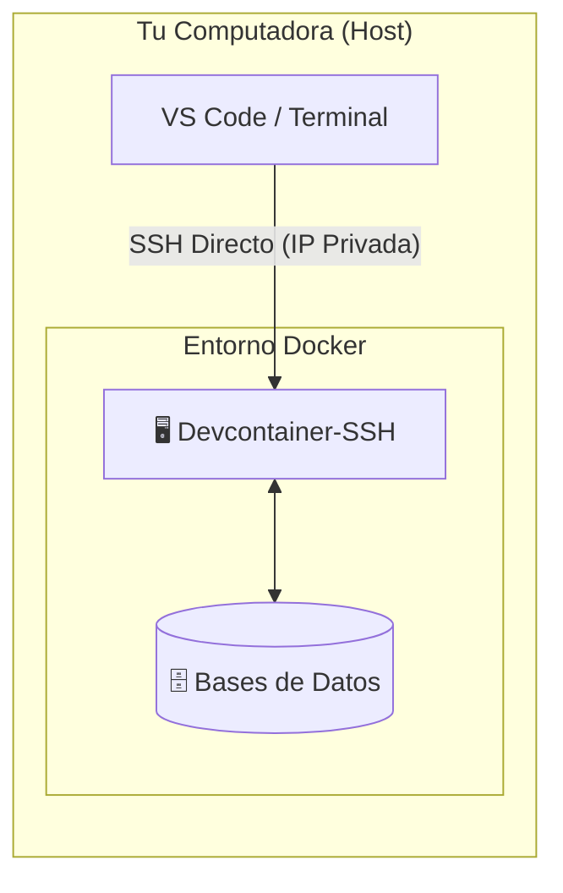
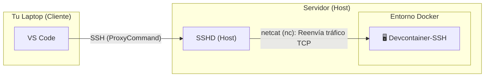
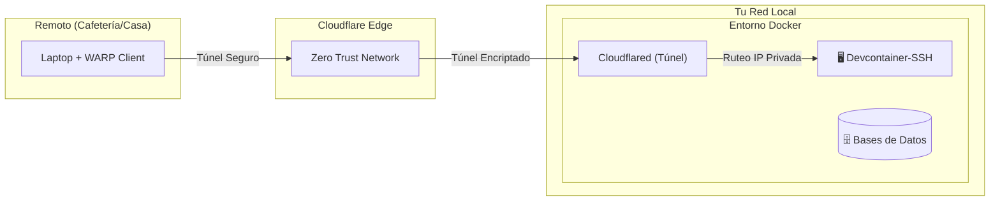

<div align="center">

# DevContainer Installer CLI

[](#)
[](#)
[](#)
[](#)
[](#)

*Automatiza la creación, orquestación y gestión de entornos aislados de desarrollo en Docker (DevContainers).*

</div>

## Resumen

**DevContainer Installer CLI** (`devcontainer-cli`) es una herramienta interactiva y extensible construida en Go. Olvídate de perder horas configurando dependencias, resolviendo conflictos de versiones y adecuando tu entorno local para cada nuevo proyecto: esta CLI automatiza la creación, orquestación y gestión de entornos aislados de desarrollo en Docker (*DevContainers*). 

Con un asistente interactivo (*TUI*), te permite componer en segundos un contenedor a medida para desarrollo con tu stack preferido, bases de datos dockerizadas, utilidades avanzadas de terminal y agentes de Inteligencia Artificial (como Claude Code, Copilot y Codex), garantizando la máxima productividad y consistencia sin ensuciar tu sistema operativo anfitrión.

## Componentes y Servicios Soportados

| Categoría | Tecnologías y Herramientas | Descripción |
| :--- | :--- | :--- |
| **Runtimes y Lenguajes** | [](#) [](#) [](#) [](#) [](#) [](#) [](#) [](#) | Módulos dinámicos para Dockerfile con versiones configurables (`nvm`/`fnm`, Corepack, `rustup`, OpenJDK/Temurin, CMake). |
| **Gestores de Paquetes** | [](#) [](#) [](#) [](#) [](#) | Integración nativa con los gestores de paquetes más populares. |
| **Bases de Datos** | [](#) [](#) [](#) [](#) | Servicios orquestados en red privada (`postgres`, `mongo`, `redis`) o cliente local (`sqlite3`). Incluye clientes CLI opcionales (`psql`, `mongosh`, `redis-cli`). |
| **Agentes de IA y Herramientas** | [](#) [](#) [](#) [](#) [](#) [](#) [](#) | CLIs e instaladores integrados para Claude Code, Copilot CLI, Codex CLI, OpenCode y Antigravity CLI, junto a utilidades como `caveman` (compresión de contexto) y `graphify` (grafos de conocimiento). |
| **Herramientas de Sistema** | [](#) [](#) [](#) [](#) | Docker-out-of-Docker (`/var/run/docker.sock`), `gh`, Chromium headless para testing/web scraping y FFmpeg para procesamiento multimedia. |
| **Red y Conectividad** | [](#) [](#) [](#) | Automatización de claves SSH, ProxyCommand para servidores remotos, túneles seguros con Cloudflare Zero Trust, Ngrok y gestión de puertos. |
| **Entorno de Terminal** | [](#) [](#) [](#) | ZSH con Oh My Zsh preconfigurado, multiplexor Zellij, editores `micro`/`nano` y manual integrado (`cat ~/help`). |

## Arquitectura y Modos de Conectividad

El entorno ofrece un contenedor principal (`devcontainer-ssh`) accesible vía SSH, permitiendo conectar tu editor (VS Code) o terminal según la infraestructura disponible:

<details>
<summary><b>1. Acceso Local (Host de desarrollo)</b></summary>

Conexión SSH directa a la IP privada del contenedor en el mismo equipo. No requiere exponer puertos al exterior.


</details>

<details>
<summary><b>2. Acceso Remoto LAN (Laptop → Servidor)</b></summary>

Conexión desde una laptop a un servidor local (Raspberry Pi, Mini PC) usando el servicio SSH del servidor como puente seguro (`netcat`), sin exponer puertos del contenedor.


</details>

<details>
<summary><b>3. Acceso Remoto Seguro (Cloudflare Tunnel)</b></summary>

Acceso desde cualquier lugar mediante Cloudflare Zero Trust y cliente WARP sin abrir puertos en el router. (Ver [CLOUDFLARE_TUNNEL.md](CLOUDFLARE_TUNNEL.md)).


</details>

## Instalación y Actualización

```bash
# Instalación rápida (Linux / macOS)
curl -fsSL https://raw.githubusercontent.com/Joacohbc/my-devcontainer-installer/main/cli/install.sh | sh

# Actualizar la CLI a la última versión
devcontainer-cli upgrade-cli

# Desinstalar la CLI
curl -fsSL https://raw.githubusercontent.com/Joacohbc/my-devcontainer-installer/main/cli/uninstall.sh | sh
```

> **Descargas manuales:** Disponibles en los [Releases de GitHub](https://github.com/Joacohbc/my-devcontainer-installer/releases/latest) (binarios standalone para `linux-x64`, `linux-arm64`, `darwin-x64` y `darwin-arm64`). El autocompletado en Zsh y Bash se configura automáticamente tras instalar.

## Uso Rápido y Flujo de Trabajo

### 1. Crear y levantar un entorno
```bash
mkdir mi-proyecto && cd mi-proyecto
devcontainer-cli                       # Asistente interactivo TUI para generar el entorno
devcontainer-cli up                    # Levanta el stack de contenedores (o ejecutá directamente devcontainer-cli ssh)
```

### 2. Conexión y configuración SSH (`devcontainer-cli ssh`)
`devcontainer-cli ssh` abre una sesión SSH en el contenedor. Si aún no está configurado el acceso SSH para el proyecto, ejecuta automáticamente el asistente de `setup-ssh` (creación de claves, alias SSH y fijado de `known_hosts`).

Los bloques `Host` se escriben en un archivo propio de la CLI, **`~/.ssh/devcontainer-cli.config`**, y no en tu `~/.ssh/config`: a ese último sólo se le agrega una línea `Include` al principio, la primera vez. Los bloques que versiones anteriores dejaron dentro de `~/.ssh/config` se mueven solos. Cambiá la ubicación con `devcontainer-cli config ssh-config-file <ruta>`.

```bash
devcontainer-cli ssh                      # Conecta al devcontainer (ejecuta setup-ssh si es la primera vez)
devcontainer-cli ssh --remote user@server # Conexión remota (ejecuta setup-ssh --remote si no existe el alias)
ssh mi-proyecto                           # Conexión directa vía cliente SSH tradicional usando el alias generado
```

### 3. Copiar archivos y assets (`copy`)
Copia archivos entre el host y el contenedor o instala scripts embebidos de IA en caliente:
```bash
devcontainer-cli copy ./app.go :/home/devuser/app.go         # Host -> Contenedor
devcontainer-cli copy --asset install-claude-code             # Materializa instalador en el contenedor
```

### 4. Sincronizar credenciales de IA y GitHub (`config shared`)
Comparte sesiones (`.claude`, `.codex`, `.gemini`, `.config/gh`) entre todos los contenedores mediante un volumen persistente:
```bash
devcontainer-cli config shared sync                           # Sembrar logins del host al volumen
devcontainer-cli config shared backup -o backup.zip            # Respaldar volumen a un file .zip
devcontainer-cli config shared restore backup.zip              # Restaurar volumen desde un file .zip
```

### 5. Contexto del contenedor para agentes de IA (`context`)
Cada contenedor trae `~/CONTEXT.md`, el documento que un agente de IA debería leer primero. **Se genera para cada proyecto** a partir de los módulos y servicios que elegiste, así que describe lo que realmente hay en esa imagen: que estás dentro de Docker, `uv` para Python, `pnpm` para JS, qué versión de Node quedó fija, y a qué host, puerto y credenciales responde cada base de datos (contenedores hermanos, nunca `localhost`). Elegir otros módulos cambia el documento.

Para lo que sólo se sabe en tiempo de ejecución está `get-devcontainer-context`, que lista las herramientas realmente instaladas con sus versiones, los servicios alcanzables y el workspace resuelto.
```bash
devcontainer-cli context                 # Reporte legible del contenedor del proyecto
devcontainer-cli context --json          # Salida estructurada, pensada para agentes
get-devcontainer-context                 # Lo mismo, desde adentro del contenedor
```

### 6. Aliases en todos los contenedores (`config alias`)
La imagen trae aliases por defecto: `kill_port <puerto>`, `npm`→`pnpm`, `npx`→`pnpm dlx`, `pip`/`pip3`→`uv pip`, y los agentes (`claude`, `codex`, `copilot`, `agy`) sin prompts de permisos —el contenedor ya es el sandbox— con `command claude` como escape.

Tus propios aliases los definís **por comandos** y se guardan en la configuración de la CLI (`config.json`), no en un archivo suelto de tu home. `config alias sync` los renderiza dentro del volumen compartido, así que se aplican a **todos** los contenedores sin reconstruir ninguna imagen y sin reiniciar nada (toman efecto en la próxima shell):
```bash
devcontainer-cli config alias                    # Listar los aliases configurados
devcontainer-cli config alias set ll "ls -la"    # Agregar o actualizar uno
devcontainer-cli config alias unset ll           # Quitar uno
devcontainer-cli config alias sync               # Aplicarlos a todos los contenedores
```
Como se sourcean después de los defaults de la imagen, lo que definas ahí siempre gana.

### 7. Conectar otros servicios a la red (`network`)
Conecta cualquier otro contenedor Docker a la red privada del workspace actual:
```bash
devcontainer-cli network connect mi-servicio-extra --alias db-extra
```

### 8. Limpieza del sistema (`clean`)
```bash
devcontainer-cli clean ssh              # Elimina bloques SSH y known_hosts obsoletos
devcontainer-cli clean all              # Menú interactivo de limpieza de imágenes/volúmenes/redes
```

## Bases de Datos y Post-Instalación

Credenciales predeterminadas para los servicios de base de datos (Usuario: `devuser` | Contraseña: `devpass`):
- **PostgreSQL:** `psql -h postgres -U devuser -d devdb`
- **MongoDB:** `mongosh --host mongo -u devuser -p devpass --authenticationDatabase admin`
- **Redis:** `redis-cli -h redis`

> Para detalles sobre actualización de contraseñas y preparación posterior, consulta **[POST_INSTALL_STEPS.md](POST_INSTALL_STEPS.md)**.

## Solución de Problemas

<details>
<summary><b>Permission denied (publickey)</b></summary>

- Ejecuta `devcontainer-cli ssh` para verificar y reinstalar automáticamente la clave pública gestionada en `~/.ssh/authorized_keys` dentro del contenedor.
- Si modificaste los archivos manualmente en el contenedor, asegura los permisos requeridos: `chmod 700 ~/.ssh` y `chmod 600 ~/.ssh/authorized_keys`.
</details>

<details>
<summary><b>Connection refused o cambio de IP / host key</b></summary>

- Confirma que el contenedor esté activo mediante `docker compose -f .dc_<workspace>/build/docker-compose.yml ps`.
- Si se reconstruyó la imagen o cambió la IP, ejecuta `devcontainer-cli ssh`: la CLI detecta el cambio, actualiza la IP y re-fija automáticamente la host key en `~/.config/devcontainer-cli/ssh/known_hosts`.
</details>

<details>
<summary><b>Error de Socket de Docker (DoD) dentro del contenedor</b></summary>

- Verifica que el módulo `dod` esté habilitado y que `.dc_<workspace>/build/docker-compose.yml` contenga el montaje `- /var/run/docker.sock:/var/run/docker.sock`.
- Asegura que el usuario `devuser` pertenezca al grupo `docker` dentro del contenedor.
</details>
