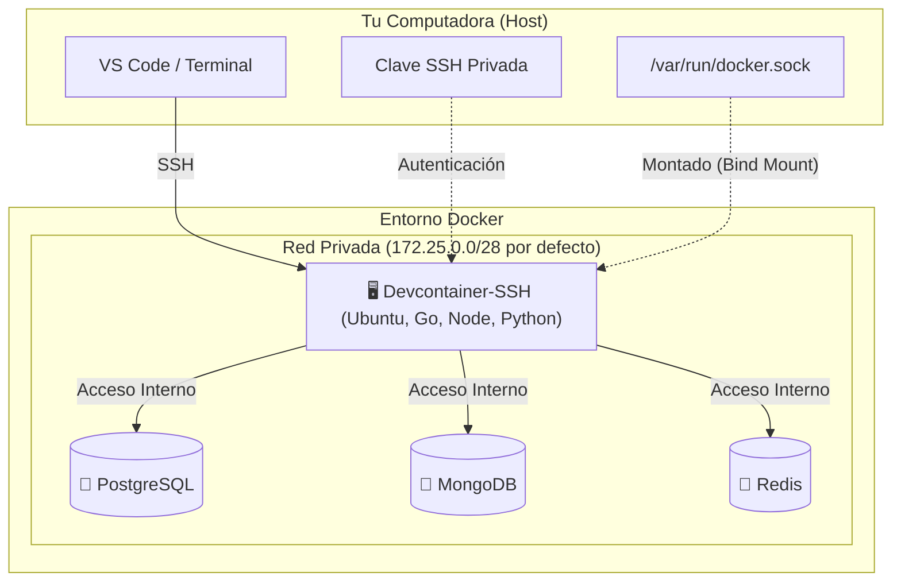
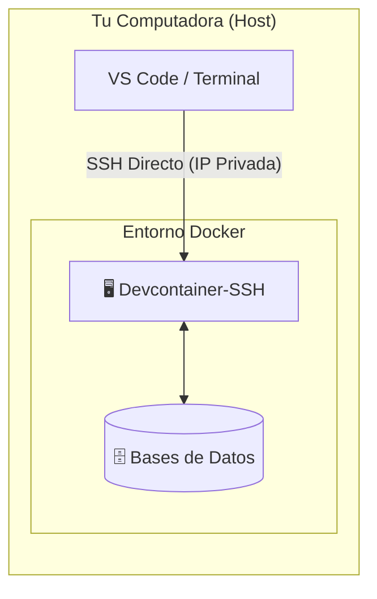
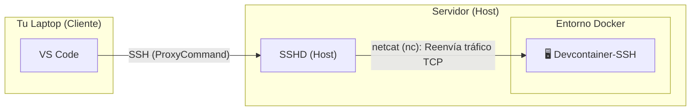
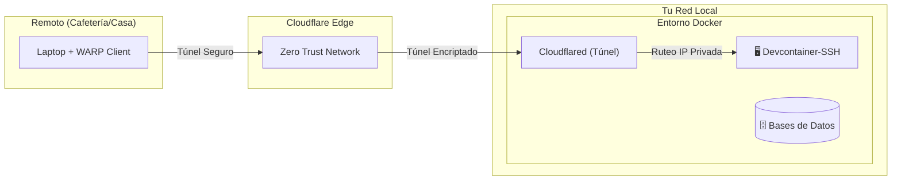

# my-devcontainer-installer

Este repositorio proporciona un entorno de desarrollo completo y remoto basado en Docker. Está diseñado para simplificar la configuración de proyectos que requieren múltiples tecnologías (bases de datos, lenguajes, herramientas) y una conectividad de red avanzada.

El entorno ofrece un contenedor principal (`devcontainer-ssh`) accesible vía SSH, con acceso directo a bases de datos y herramientas de desarrollo preinstaladas, simulando una máquina virtual ligera pero con la flexibilidad de Docker.

## Arquitectura

El siguiente diagrama ilustra cómo interactúan los componentes del entorno:



### 1. Acceso Local (Tu PC es el Host)

**Recomendado para**: Trabajar directamente en la máquina donde corre Docker.

Se establece una conexión SSH directa desde tu terminal o VS Code hacia la IP privada del contenedor, aprovechando que ambos están en el mismo equipo. Sin exponer puertos.



### 2. Acceso Remoto LAN (Laptop -> Servidor)

**Recomendado para**: Conectar tu laptop a un servidor doméstico (ej. Raspberry Pi, Mini PC) dentro de tu red.

Utiliza el servicio SSH del servidor anfitrión como puente seguro. El tráfico se redirige internamente hacia el contenedor (usando netcat), lo que evita tener que exponer puertos del contenedor a toda la red local.



### 3. Acceso Remoto Seguro (Cloudflare Tunnel)

**Recomendado para**: Acceder desde cualquier lugar (cafeterías, viajes) sin abrir puertos en el router.

Mediante Cloudflare Zero Trust, se crea un túnel cifrado de salida. Esto permite que tu dispositivo remoto (autenticado con WARP) acceda a la red privada del contenedor de forma segura, como si estuvieras conectado localmente.



## Características Principales

* **Sistema Base:** Ubuntu 24.04 LTS (Noble) por defecto. 22.04 (Jammy) seleccionable.
* **Conexión SSH:** Acceso seguro mediante OpenSSH Server. Ideal para usar con VS Code Remote - SSH o tu terminal favorita.
* **Persistencia y Sincronización:**
  * El directorio del repositorio se monta en `/workspace` dentro del contenedor.
  * Los archivos de configuración y datos de usuario (`/home`, `/root`, `/etc`) se persisten en volúmenes Docker.
* **Bases de Datos (Dockerizadas, versión configurable por la CLI):**
  * MongoDB — default `8.0` (opciones: `7.0`, `8.0`, `8.3`).
  * Redis — default `7.4-alpine` (opciones: `7.4-alpine`, `8.0-alpine`, `8.6-alpine`).
  * PostgreSQL — default `17-alpine` (opciones: `16-alpine`, `17-alpine`, `18-alpine`).
* **Lenguajes y Herramientas Preinstalados (módulos opcionales):**
  * **Java:** Temurin (default 11+17) u OpenJDK (default 17), Maven opcional. Versiones 11/17/21 disponibles.
  * **Python:** Python 3 + pip, con `uv` (Astral) opcional.
  * **Node.js:** `nvm` (default) o `fnm`. Versión: LTS, 22 o 24.
  * **pnpm / Bun:** instaladores oficiales como módulos opcionales.
  * **Go:** Última versión (instalada vía script utilitario, módulo `go`).
  * **SQLite:** sqlite3 (módulo `sqlite`).
  * **Clientes de DB en el devcontainer:** `psql`, `redis-cli`, `mongosh` (módulo `dbclients`).
  * **Herramientas CLI:** `git`, `gh` (GitHub CLI), `docker-ce-cli` (Docker outside Docker, módulo `dod`), `nano`, `wget`, `jq`.
  * **AI CLIs (opcional, módulo `ai-clis`):** scripts de instalación embebidos para Claude Code, Gemini CLI, OpenCode y Autoskills.
* **Terminal Mejorada:** ZSH preconfigurado con frameworks y plugins útiles.

## Modos de Build

La CLI ofrece dos modos para controlar cómo se construye la imagen del devcontainer. Se elige con `--mode` o por prompt interactivo.

| Modo | Genera | Imagen | Para qué sirve |
|---|---|---|---|
| `local-cached` (default) | `Dockerfile` + `docker-compose.yml` | `devcontainer-cli/<fp12>:latest` | Build local. Deduplica por fingerprint del Dockerfile: si la imagen ya está en el daemon, no rebuildea. |
| `remote` | `docker-compose.yml` (sin Dockerfile) | `ghcr.io/<owner>/devcontainer-<variant>:latest` | Salta el build. Usa las imágenes pre-buildeadas por GitHub Actions. Mucho más rápido. |

**Variants disponibles** (para `remote`): `ssh` (imagen completa), `nodejs`, `bun`, `java-temurin`, `python`, `go`, `node-go`, `node-python`, `node-java-temurin`, `bun-go`, `bun-python`, `bun-java-temurin`.

### Ejemplos

```bash
# Local-cached (default) — build local con dedup por fingerprint
devcontainer-cli --with nodejs,java-temurin --service mongo

# Remote — pull de imagen pre-buildeada, sin Dockerfile
devcontainer-cli --mode remote --variant node-java-temurin --service postgres
```

### Actualizar imágenes

```bash
# Actualizar la imagen del proyecto actual (pull para remote, build --pull para local-cached)
devcontainer-cli update

# Actualizar TODAS las imágenes de los proyectos que conoce la CLI
devcontainer-cli update --all

# Forzar rebuild aunque el fingerprint coincida
devcontainer-cli update --rebuild
```

> **Nota:** `update` opera sobre imágenes de proyecto. Para actualizar el binario de la CLI usá `devcontainer-cli upgrade-cli`.

## Contenedor rápido (`run`)

Levanta un container desde una imagen remota **sin crear ningún archivo** en el proyecto (sin `.dc_*/`, sin `devcontainer.config.json`). Ideal para tareas puntuales o exploración rápida.

```bash
# Interactivo — elige la variante por prompt
devcontainer-cli run

# Directo — especifica variante
devcontainer-cli run --variant python

# Con volumen persistente en /workspace
devcontainer-cli run --variant nodejs --volume mi_workspace

# Con puerto SSH expuesto al host
devcontainer-cli run --variant ssh --port 2222

# Todo junto
devcontainer-cli run --variant node-go --name mi-dev --volume mi_vol --port 2222
```

El comando es **idempotente**: si el container ya existe (exited o paused) lo reinicia; si ya está corriendo no hace nada.

Al finalizar imprime el comando para continuar con SSH:

```bash
devcontainer-cli setup-ssh --container dc-<variant>
```

**Flags disponibles:**

| Flag | Descripción |
|---|---|
| `--variant <name>` | Variante de imagen remota |
| `--name <name>` | Nombre del container (default: `dc-<variant>`) |
| `--volume <name>` | Named volume montado en `/workspace` (opcional) |
| `--port <n>` | Expone el puerto 22 del container en el host |
| `--registry <url>` | Override del registry (default: `ghcr.io/joacohbc/`) |

## Limpieza de recursos

### Bajar el proyecto (`down`)

Corre `docker compose down -v` para el proyecto en el directorio actual:

```bash
devcontainer-cli down

# Sin confirmación
devcontainer-cli down --yes
```

Elimina los contenedores y volúmenes del stack. Requiere que exista `.dc_<workspace>/build/docker-compose.yml`.

### Limpiar imágenes huérfanas (`prune`)

Elimina las imágenes `devcontainer-cli/*` cuyo proyecto ya no existe en disco:

```bash
# Solo huérfanas (proyecto borrado o movido)
devcontainer-cli prune

# Todas las imágenes devcontainer-cli/* sin excepción
devcontainer-cli prune --all

# Sin confirmación
devcontainer-cli prune --yes
```

### Configurar registry global

```bash
# Ver el registry actual
devcontainer-cli config registry

# Cambiarlo (por ejemplo si forkeaste y publicaste en tu propio org)
devcontainer-cli config registry ghcr.io/mi-org/

# Restaurar el default
devcontainer-cli config registry --unset
```

El registry también se puede override por invocación con `--registry ghcr.io/foo/`.

## Requisitos Previos

* Docker y Docker Compose.
* Cliente SSH (OpenSSH) instalado en tu máquina local.
* Conocimiento básico de terminal.

### Nota Importante para Windows

Si estás utilizando **Windows**, se recomienda encarecidamente usar **Git Bash** como terminal. Esto garantiza la compatibilidad con los comandos de Linux (`grep`, `tail`, `ssh-copy-id`, etc.) y facilita la configuración.

1.  **Formato de Archivos (LF vs CRLF):** Los scripts y archivos de configuración deben tener terminaciones de línea estilo UNIX (`LF`). Se ha incluido un archivo `.gitattributes` para manejar esto automáticamente.
2.  **Firewall:** Para conectarte al contenedor, es necesario que el firewall de Windows permita las conexiones al puerto expuesto (por defecto `2222`).

## Instalación y Configuración

La CLI genera el `Dockerfile`, `docker-compose.yml`, `.env` y archivos auxiliares según los módulos que selecciones (Node, Java, Mongo, Postgres, Redis, Cloudflare Tunnel, etc.) — sin clonar el repo.

### 1. Instalar la CLI (one-liner)

**Linux / macOS:**

```bash
curl -fsSL https://raw.githubusercontent.com/Joacohbc/my-devcontainer-installer/main/cli/install.sh | sh
```

Detecta OS/arch automáticamente. Descarga el binario (single executable con assets embebidos) en `~/.local/share/devcontainer-cli/` y lo enlaza en `~/.local/bin/devcontainer-cli`.

**Windows (PowerShell):**

```powershell
irm https://raw.githubusercontent.com/Joacohbc/my-devcontainer-installer/main/cli/install.ps1 | iex
```

Instala en `%LOCALAPPDATA%\devcontainer-cli` y agrega al PATH del usuario.

**Variables opcionales:**

| Var          | Default                                  | Descripción                       |
|--------------|------------------------------------------|-----------------------------------|
| `VERSION`    | `latest`                                 | Tag específico (ej. `v1.0.0`)     |
| `INSTALL_DIR`| `~/.local/share/devcontainer-cli` (unix) | Carpeta del binario               |
| `BIN_DIR`    | `~/.local/bin` (unix)                    | Symlink al binario                |

Ejemplo versión fija:

```bash
curl -fsSL https://raw.githubusercontent.com/Joacohbc/my-devcontainer-installer/main/cli/install.sh | VERSION=v1.0.0 sh
```

**Descarga manual** (alternativa): https://github.com/Joacohbc/my-devcontainer-installer/releases/latest — binarios disponibles: `devcontainer-cli-linux-x64`, `-linux-arm64`, `-darwin-x64` y `-windows-x64.exe`. Son ejecutables únicos (assets embebidos via Node.js SEA); descargás, `chmod +x` y listo.

### 2. Generar el entorno

```bash
mkdir mi-proyecto && cd mi-proyecto
devcontainer-cli
```

Modo no-interactivo:

```bash
devcontainer-cli --with nodejs,java --service mongo,postgres --image mi-dev:local --no-build
```

Ayuda completa: `devcontainer-cli --help`.

La CLI genera todo dentro de `.dc_<workspace>/` (donde `<workspace>` es el nombre del directorio actual, o el valor de `--workspace`):

```
.dc_<workspace>/
├── build/          # Dockerfile, docker-compose.yml, .env, helper .sh
└── post-script/    # Scripts post-instalación, ejecutables dentro del container
```

**Subcomandos disponibles:**

| Subcomando                       | Qué hace                                                                                                    |
|----------------------------------|-------------------------------------------------------------------------------------------------------------|
| `devcontainer-cli`               | Genera/actualiza `Dockerfile`, `docker-compose.yml`, `.env` y scripts auxiliares (flujo interactivo o no). |
| `devcontainer-cli setup-ssh`     | Configura el acceso SSH autodetectando el compose del proyecto. Ver [Acceso y Uso](#acceso-y-uso).          |
| `devcontainer-cli run`           | Levanta un container desde una imagen remota sin crear archivos de proyecto. Ver [Contenedor rápido](#contenedor-rápido-run). |
| `devcontainer-cli down`          | `docker compose down -v` para el proyecto en el directorio actual.                                         |
| `devcontainer-cli prune`         | Elimina imágenes `devcontainer-cli/*` huérfanas (proyecto borrado). `--all` elimina todas.                 |
| `devcontainer-cli update`        | Actualiza la imagen del proyecto actual (pull o rebuild según el modo). `--all` recorre todos los proyectos.|
| `devcontainer-cli upgrade-cli`   | Reemplaza el binario de la CLI con la última release de GitHub.                                             |
| `devcontainer-cli config`        | Lee/escribe configuración global (ej. `config registry ghcr.io/mi-org/`).                                   |
| `devcontainer-cli cleanup-tips`  | Imprime los comandos `docker` para borrar contenedores, redes y volúmenes del proyecto.                     |

### 3. Iniciar el entorno

```bash
docker compose -f .dc_<workspace>/build/docker-compose.yml up -d
```

Si deseas personalizar la configuración de red (opcional), edita `.dc_<workspace>/build/.env` antes de iniciar (ver [CLOUDFLARE_TUNNEL.md](CLOUDFLARE_TUNNEL.md)).

## Acceso y Uso

La forma recomendada y más segura de acceder es mediante **Claves SSH**. El uso de contraseñas debería limitarse únicamente a la configuración inicial.

### 1. Preparación (Host)

Primero, obtén la contraseña temporal generada durante la instalación. La necesitarás **solo una vez** para instalar tu clave SSH.

```bash
docker compose logs devcontainer-ssh | grep "devuser password" | tail -n 1
```

### 2. Configurar Acceso SSH (Recomendado)

Tienes dos caminos: el modo **automático** con `devcontainer-cli setup-ssh` (recomendado) o el manual paso a paso.

#### Opción A: Modo automático (`setup-ssh`)

La CLI puede generar la clave, copiarla al contenedor y dejar listo el bloque `~/.ssh/config` por ti. Detecta automáticamente el `container_name` desde `docker-compose.yml` (incluyendo el prefijo del workspace) y elige el modo (`local`, `windows` o `remote`) según el contexto.

Desde la carpeta del proyecto (donde está el `docker-compose.yml`):

```bash
# Local / Windows (autodetecta): genera clave si falta, copia al contenedor, escribe ~/.ssh/config
devcontainer-cli setup-ssh

# Forzar un modo concreto
devcontainer-cli setup-ssh --mode local
devcontainer-cli setup-ssh --mode windows --port 2222

# Acceso remoto vía servidor con ProxyCommand
devcontainer-cli setup-ssh --remote usuario@servidor

# No interactivo (CI o scripts)
devcontainer-cli setup-ssh --yes --alias devcontainer --key ~/.ssh/id_devcontainer
```

Ayuda completa: `devcontainer-cli setup-ssh --help`.

Tras esto puedes conectar directamente con `ssh devcontainer` (o el alias que hayas pasado).

#### Opción B: Manual

Sigue estos pasos desde tu máquina local (tu PC o Laptop) para autorizar tu acceso sin contraseña.

##### A. Generar par de claves (Si no tienes una)

Se recomienda usar una clave específica para este entorno:

```bash
ssh-keygen -t ed25519 -f ~/.ssh/id_devcontainer -N "" -q
```

##### B. Instalar la clave en el contenedor

**Opción 1: Entorno Local (Linux/Mac)**
(Si Docker corre en la misma máquina que estás usando)

> El `container_name` real se prefija con el `workspace` configurado (ej: `mi-proyecto-devcontainer-ssh`). Reemplaza `<workspace>` por el nombre que elegiste en la CLI (o consulta `docker ps`).

```bash
# 1. Obtener IP del contenedor
IP_SSH=$(docker inspect -f '{{range .NetworkSettings.Networks}}{{.IPAddress}}{{end}}' <workspace>-devcontainer-ssh)

# 2. Copiar clave (te pedirá la contraseña obtenida en el paso 1)
ssh-copy-id -i ~/.ssh/id_devcontainer.pub devuser@$IP_SSH

# 3. Guardar configuración en tu SSH config
cat <<EOF >> ~/.ssh/config
Host devcontainer
    HostName $IP_SSH
    IdentityFile ~/.ssh/id_devcontainer
    User devuser
EOF
```

**Opción 2: Entorno Local (Windows con Git Bash)**
(Usando el puerto expuesto 2222)

```bash
# 1. Copiar clave pública al contenedor (te pedirá la contraseña)
# Nota: Git Bash suele incluir ssh-copy-id, si no, usa el comando manual:
ssh-copy-id -p 2222 -i ~/.ssh/id_devcontainer.pub devuser@localhost

# Alternativa manual si ssh-copy-id no está disponible:
# cat ~/.ssh/id_devcontainer.pub | ssh -p 2222 devuser@localhost "mkdir -p ~/.ssh && cat >> ~/.ssh/authorized_keys && chmod 700 ~/.ssh && chmod 600 ~/.ssh/authorized_keys"

# 2. Añadir a config (Ejecuta esto en Git Bash)
cat <<EOF >> ~/.ssh/config
Host devcontainer
    HostName localhost
    Port 2222
    User devuser
    IdentityFile ~/.ssh/id_devcontainer
EOF
```

**Opción 3: Entorno Remoto**
(Si Docker corre en un servidor y tú estás en tu laptop)

Sustituye `usuario@servidor` por los datos de conexión a tu servidor físico.

```bash
cat ~/.ssh/id_devcontainer.pub | ssh usuario@servidor "docker exec -i -u devuser <workspace>-devcontainer-ssh sh -c 'mkdir -p ~/.ssh && cat >> ~/.ssh/authorized_keys && chmod 700 ~/.ssh && chmod 600 ~/.ssh/authorized_keys'"
```

Para conectar fácilmente, añade esto a tu `~/.ssh/config`:

```ssh
Host devcontainer-remote
    User devuser
    IdentityFile ~/.ssh/id_devcontainer
    ProxyCommand ssh usuario@servidor "nc -q0 \$(docker inspect -f '{{range .NetworkSettings.Networks}}{{.IPAddress}}{{end}}' <workspace>-devcontainer-ssh) 22"
```

### 3. Conectarse

Ahora puedes conectar simplemente con el alias que hayas configurado:

```bash
ssh devcontainer
# O
ssh devcontainer-remote
```

## Pasos Post-Instalación

Una vez dentro, puedes ejecutar los scripts de configuración incluidos para terminar de preparar tu entorno:

* **GitHub CLI:** `/workspace/.dc_<workspace>/post-script/login-github-cli.sh` - Te ayuda a iniciar sesión y configurar tus credenciales de GitHub.
* **Actualizar Go:** `/workspace/.dc_<workspace>/post-script/update_golang.sh` - Actualiza la instalación de Go a la última versión estable disponible (solo si elegiste el módulo `go`).
* **Actualizar Sistema:** Es relevante mantener el entorno al día (incluyendo e.g. el cliente de Docker) ejecutando `sudo apt update && sudo apt upgrade -y`.

Consulta [POST_INSTALL_STEPS.md](POST_INSTALL_STEPS.md) para más detalles sobre backups y herramientas adicionales.

## Agregar Servicios Extra (Docker Run)

Para levantar un contenedor nuevo (por ejemplo, una base de datos extra o un servicio temporal) asegurando que el DevContainer pueda verlo y conectarse a él, es necesario que ambos compartan la misma red Docker.

La red Docker generada se llama `<workspace>-network` (donde `<workspace>` es el nombre que configuraste en la CLI). Puedes usar el siguiente comando, que detecta automáticamente el nombre de la red del proyecto y conecta el nuevo servicio:

```bash
docker run -d \
  --name <nombre-del-servicio> \
  --network $(docker network ls -q -f name=<workspace>-network) \
  <imagen>
```

**Explicación de las banderas:**

*   `--network $(...)`: Busca dinámicamente el ID de la red `<workspace>-network` del proyecto.
*   `--name`: Asigna el hostname. Esto permite que, desde dentro del DevContainer, puedas hacer ping o conectarte usando este nombre (ej: `ping <nombre-del-servicio>`).

## Solución de Problemas (Troubleshooting)

### Error: "Permission denied (publickey)"

* Asegúrate de haber copiado tu clave pública (`.pub`) al contenedor correctamente.
* Verifica los permisos en el contenedor: la carpeta `~/.ssh` debe tener `700` y `authorized_keys` debe tener `600`.

### Error: "Connection refused"

* Verifica que el contenedor esté corriendo: `docker compose ps`.
* Si usas IP dinámica (Local), asegúrate de que la IP no haya cambiado. Si reiniciaste el contenedor, es posible que necesites actualizar la IP en tu `~/.ssh/config`.
* **Windows:** Verifica que el Firewall de Windows permita conexiones entrantes al puerto 2222.

### Problemas con Docker dentro del contenedor

* Si comandos como `docker ps` fallan dentro del contenedor, verifica que el socket esté montado correctamente en `docker-compose.yml`:
    `- /var/run/docker.sock:/var/run/docker.sock`
* Asegúrate de que el usuario `devuser` pertenezca al grupo `docker` (esto se hace automáticamente en el Dockerfile).

### Conflicto de Puertos

* Si Docker falla al iniciar porque un puerto (ej. 27017, 5432, 2222) ya está en uso, detén el servicio local que lo ocupa en tu máquina host o modifica el mapeo de puertos en `.dc_<workspace>/build/docker-compose.yml`.

## Estructura del Proyecto

Tras ejecutar `devcontainer-cli` en tu directorio de trabajo obtendrás:

```
<tu-proyecto>/
├── devcontainer.config.json          # Estado persistido (módulos, servicios, subnet)
└── .dc_<workspace>/
    ├── build/                        # Todo lo que necesita `docker build`
    │   ├── Dockerfile
    │   ├── docker-compose.yml
    │   ├── .env                      # DOCKER_SUBNET, DEVCONTAINER_IP, TUNNEL_TOKEN…
    │   ├── entrypoint.sh
    │   ├── zsh-installer.sh
    │   ├── golang_utils.sh           # solo con módulo `go`
    │   └── install-*.sh              # solo con módulo `ai-clis`
    └── post-script/                  # Scripts ejecutables dentro del contenedor
        ├── login-github-cli.sh
        └── update_golang.sh          # solo con módulo `go`
```

Tu código vive en `<tu-proyecto>/` (la raíz), que se monta como `/workspace` dentro del contenedor.

## Bases de Datos

Credenciales por defecto: **Usuario:** `devuser` / **Password:** `devpass`.

Desde dentro del devcontainer (los hostnames son los nombres de servicio en `docker-compose.yml`, sin el prefijo del workspace):

* **PostgreSQL:** `psql -h postgres -U devuser -d devdb`
* **MongoDB:** `mongosh --host mongo -u devuser -p devpass --authenticationDatabase admin`
* **Redis:** `redis-cli -h redis`

> Los clientes (`psql`, `mongosh`, `redis-cli`) solo están preinstalados si seleccionaste el módulo `dbclients` al generar el entorno.
